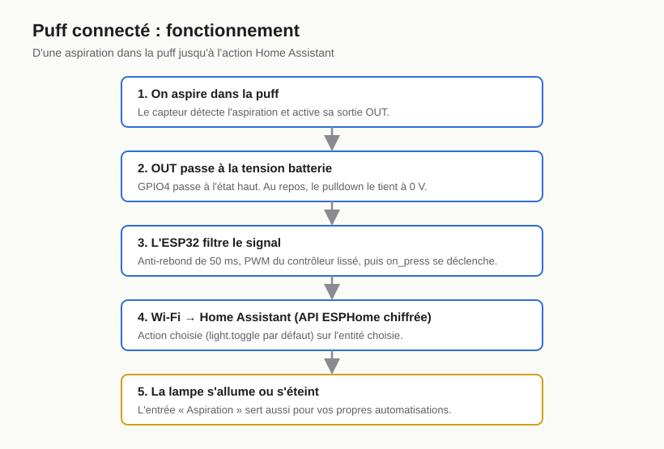
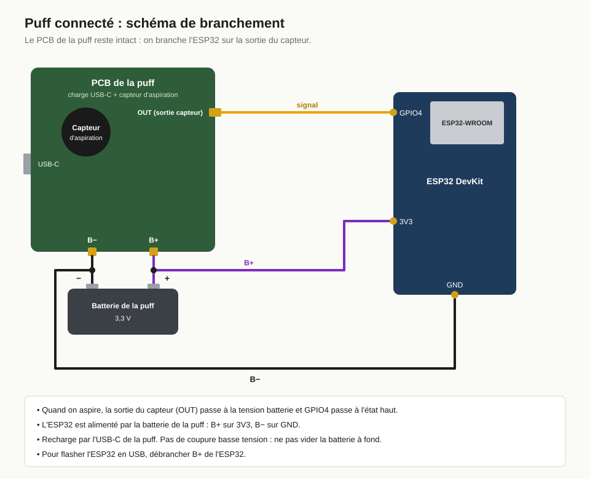

# Puff connecté

Puff connecté : le capteur d'aspiration d'une puff rechargeable est relié à un ESP32. Quand on aspire dedans, l'ESP32 lance une action Home Assistant, par défaut allumer ou éteindre une lampe (`light.toggle`).



## Principe

Le PCB d'une puff rechargeable regroupe la charge USB-C, le capteur d'aspiration et le contrôleur. On le garde intact et on branche l'ESP32 sur la sortie du capteur (`OUT`) : quand on aspire, elle passe à la tension batterie, et l'ESP32 lit ce signal sur `GPIO4`. La batterie de la puff, déjà soudée au PCB, alimente aussi l'ESP32.

Prototype réalisé avec une puff JNR 16k et un ESP32 DevKit. Les autres puffs rechargeables fonctionnent sur le même principe, mais leurs pads peuvent différer.

## Fichiers

- `puff-connecte.yaml` : configuration ESPHome. Tous les réglages sont dans le bloc `substitutions` en haut du fichier.
- `secrets.example.yaml` : modèle des identifiants Wi-Fi, clé API et mot de passe OTA. À copier en `secrets.yaml`, qui est ignoré par git.
- `schema-branchement.svg` : schéma de câblage.
- `schema-fonctionnement.svg` : de l'aspiration jusqu'à l'action Home Assistant.

## Matériel

- Une puff rechargeable en USB-C.
- Un ESP32 (par exemple un ESP32 DevKit, `esp32dev`).
- Du fil, un fer à souder et un multimètre.

## Branchement



| PCB de la puff | ESP32 |
|----------------|-------|
| `OUT` (sortie capteur) | `GPIO4` |
| `B+` | `3V3` |
| `B-` | `GND` |

La batterie (3,3 V) reste soudée au PCB de la puff.

## Préparer la puff

La batterie d'une puff n'a pas de circuit de protection. Un court-circuit entre ses bornes peut la faire chauffer, gonfler ou prendre feu. Travailler sans jamais mettre en contact `B+` et `B-`, et isoler chaque fil dénudé.

Le e-liquide contient de la nicotine : l'essuyer, éviter le contact avec la peau et se laver les mains.

1. Ouvrir la puff et retirer le réservoir.
2. Dessouder ce qui est branché sur la sortie du capteur.
3. Trouver `OUT` : multimètre en mode tension, pointe noire sur `B-`. Mesurer chaque pad de sortie du capteur en aspirant dans la puff. Celui qui monte à la tension de la batterie est `OUT`. Si aucun ne bouge, voir « Dépannage ».
4. Câbler selon le schéma : `OUT` sur `GPIO4`, `B+` sur `3V3`, `B-` sur `GND`.

## Installation

1. Copier `secrets.example.yaml` en `secrets.yaml` et le remplir.
2. Adapter le bloc `substitutions` de `puff-connecte.yaml` : au minimum `entity_id`, l'entité à piloter. `action` peut être n'importe quelle action Home Assistant qui accepte un `entity_id` (`light.toggle`, `switch.toggle`, `script.turn_on`…).
3. Flasher l'ESP32, en USB la première fois, puis sans fil :

   ```bash
   esphome run puff-connecte.yaml
   ```

   Débrancher `B+` de l'ESP32 pendant un flash en USB. Le dashboard ESPHome de Home Assistant fonctionne aussi.
4. Ajouter l'appareil dans Home Assistant (il est découvert automatiquement). Dans les options de l'appareil ESPHome, activer « Autoriser l'appareil à effectuer des actions Home Assistant ». Sans cette option, l'action est refusée.

Pour piloter autre chose sans modifier le fichier, une valeur peut être passée en ligne de commande :

```bash
esphome -s entity_id light.salon run puff-connecte.yaml
```

L'appareil expose aussi un capteur binaire « Aspiration ». Pour gérer la logique dans Home Assistant plutôt que dans l'ESP32, retirer le bloc `on_press` et créer une automatisation déclenchée par ce capteur.

## Batterie

- Recharge par le port USB-C de la puff.
- Il n'y a pas de coupure basse tension : ne pas laisser la batterie se vider complètement.
- Avec le Wi-Fi allumé en permanence (≈ 100 mA), l'autonomie est de quelques heures par charge.

## Dépannage

- **Rien ne se déclenche.** Regarder les logs avec `esphome logs puff-connecte.yaml` en aspirant. Si aucune sortie du capteur ne monte à la tension batterie, le capteur coupe côté masse : `OUT` descend à 0 V quand on aspire. Brancher cette sortie sur `GPIO4` et mettre `pulldown: "false"`, `pullup: "true"` et `inverted: "true"` dans les substitutions.
- **Déclenchements parasites.** Augmenter `delayed_on`, par exemple à `100ms`.
- **Un seul appui déclenche plusieurs fois.** Augmenter `delayed_off`, par exemple à `200ms`. Certains capteurs envoient sur leur sortie un signal haché (PWM).
- **« Aspiration » change d'état mais rien ne se passe.** Vérifier l'option « actions Home Assistant » (étape 4 de l'installation) et la valeur de `entity_id`.
